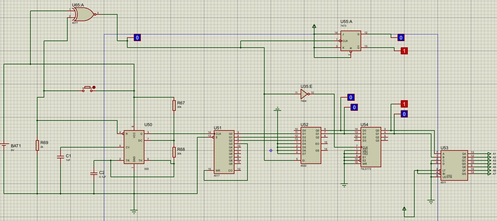
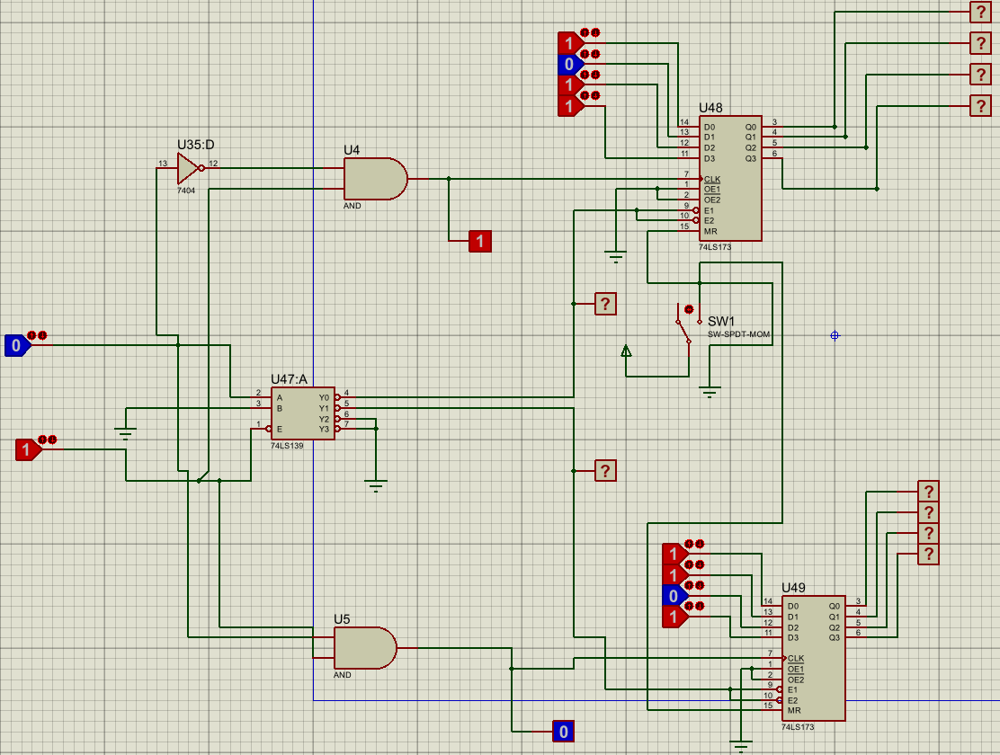
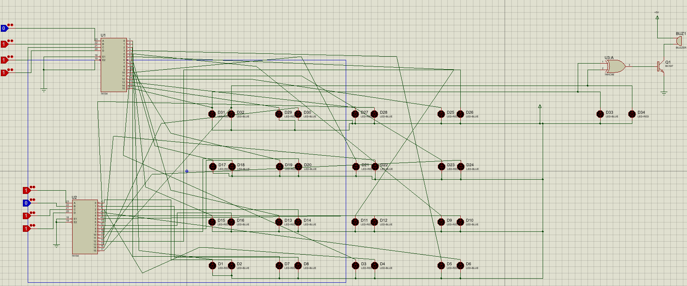
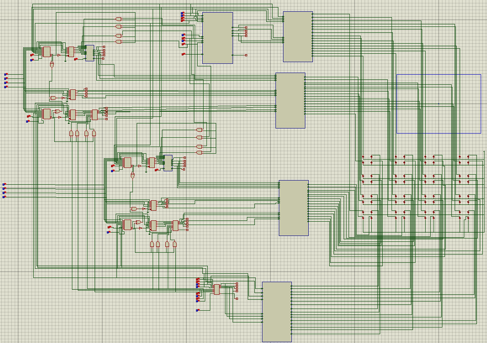
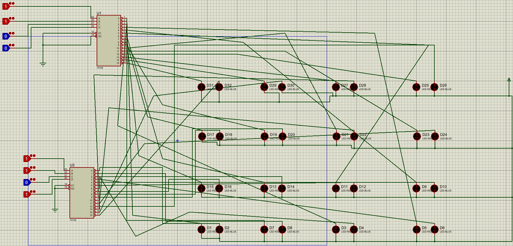
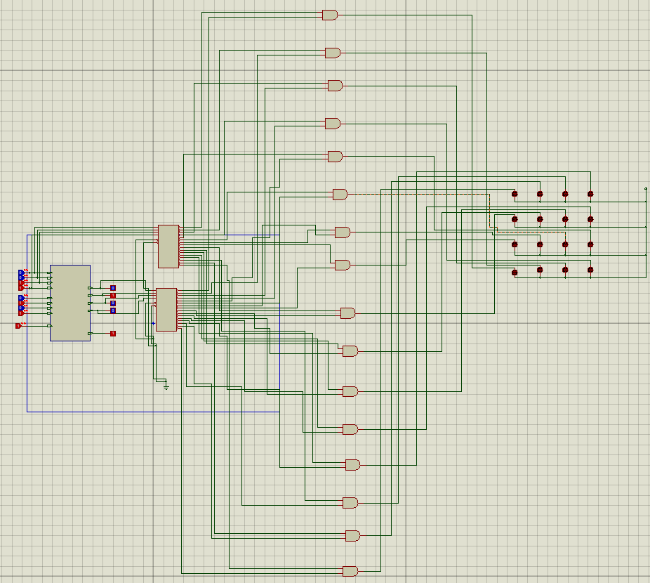
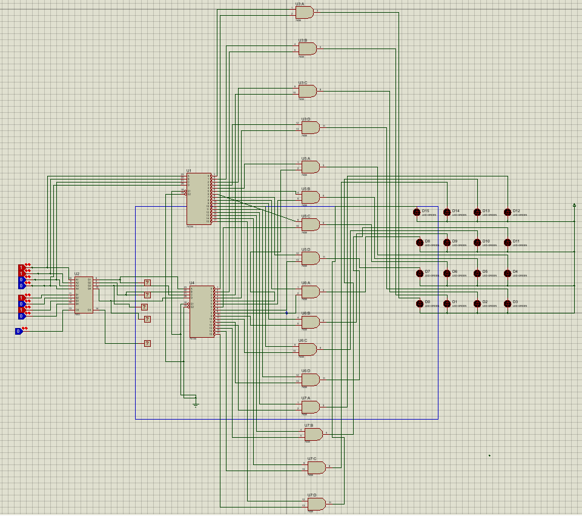
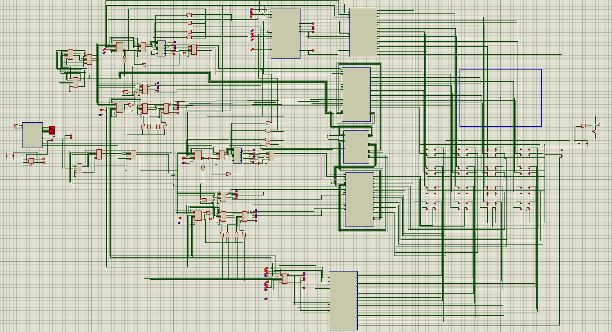

# 🐍🪜 Digital Snake Ladder Game

A two-player **Snake & Ladder game built entirely from digital logic ICs** and simulated in **Proteus**. There is no microcontroller and no code: dice rolling, turn selection, position memory, snake/ladder logic and winner detection are all done with counters, multiplexers, adders, flip-flops and registers.

> **Course:** EEE 4308 – Digital Electronics Lab<br>
> **Department:** Electrical and Electronic Engineering, Islamic University of Technology (IUT)<br>
> **Group:** Trailblazers

---

## 📖 Table of Contents

- [Overview](#-overview)
- [Game Rules](#-game-rules)
- [Modules and Schematics](#-modules-and-schematics)
- [Components Used](#-components-used)
- [Repository Structure](#-repository-structure)
- [How to Run the Simulation](#-how-to-run-the-simulation)
- [Complete Integrated Circuit](#-complete-integrated-circuit)
- [Team & Contributions](#-team--contributions)
- [Project Report](#-project-report)
- [Acknowledgements](#-acknowledgements)

---

## 🔍 Overview

The game board has **15 positions**. Two players (Player 1 = blue, Player 2 = red) take turns rolling a digital dice. The dice value is added to the player's stored position; if the new position is a snake head or a ladder bottom, the position is moved accordingly. The first player to land exactly on **position 15** wins, and the winner's LED lights up together with a buzzer.

The project was developed in phases:

| Phase | Work |
|-------|------|
| Earlier phases | Board, snake, ladder and player-position modules |
| **Phase C** | Dice module and high-frequency clock using a 555 timer |
| **Phase D** | Memory, reset, player selector and winner indicator modules |
| **Phase E** | Complete integration of the full game |

---

## 🎮 Game Rules

1. Player 1 (blue, selector output `0`) always starts; the turn then alternates with each button press.
2. On a turn, the dice value is added to the current player's stored position.
3. **Exact finish rule:** if the sum would go beyond 15, the player does **not** move and stays at the previous position. For example, a player on 14 only advances if the dice shows 1.
4. Landing on a **snake head** moves the player down; landing on a **ladder bottom** moves the player up.
5. The first player to reach position **15** wins.
6. A **reset switch** clears both players' positions and restarts the game.

---

## 🔧 Modules and Schematics

### 1. Dice Module & High-Frequency Clock (Phase C)
- A **555 timer** generates a high-frequency clock. The frequency can be tuned by changing the resistor and capacitor values.
- The clock drives a **4017 Johnson counter**. Because the clock is so fast, its outputs change far quicker than a person can react, which makes the result effectively random.
- A **priority encoder** converts the counter outputs into a **2-bit binary** value.
- A **2-bit parallel-in parallel-out register** (D flip-flops) latches the value when the clock pulse arrives; this is the final dice value.
- A **BCD to 7-segment decoder** displays the dice value.

### 2. Player Selector Module (Phase D)
- Uses a **JK flip-flop with J = K = 1**, so it toggles on every button press.
- Output `0` = Player 1 (blue), output `1` = Player 2 (red).
- Ensures players roll one after another.


*Dice and Player Selector module schematic*

### 3. Memory Module (Phase D)
- Stores each player's current position in **74LS173 4-bit registers**, one per player.
- The player-select signal enables only the active player's register.
- Extra multiplexers on the register inputs/outputs fix a **one-clock-pulse-behind** problem, so the LEDs show the correct dice-updated value for the current player.
- The stored value feeds the adder in the integrated circuit.

### 4. Reset Module (Phase D)
- The master-reset (MR) pin of the registers is normally tied to ground.
- An **SPDT switch** disconnects MR from ground and connects it to power, which clears all stored positions and resets the game.


*Memory and Reset module schematic*

### 5. Winner Indicator Module (Phase D)
- The player LEDs at position 15 feed an **XOR gate**.
- When exactly one player reaches 15, the XOR output goes high, driving a **BC547 transistor** that sounds the **buzzer**, while that player's LED shows who won.


*Winning module schematic*

### 6. Board, Snake, Ladder and Player Position Modules (earlier phases)

| Board module | Player position module |
|:------------:|:----------------------:|
|  |  |

| Snake module | Ladder module |
|:------------:|:-------------:|
|  |  |

### 7. Complete Integration (Phase E)
- **Adder (7483):** adds the dice value to the player's stored position.
- **MUX-1:** the adder's carry-out selects between the new sum (no overflow) and the old stored position (overflow), which implements the exact-finish rule.
- **MUX-2:** driven by the player selector so only the active player's value passes through.
- **Snake / ladder / normal logic:** uses comparators and multiplexers to detect snake heads and ladder bottoms and set the next position.

---

## 🧰 Components Used

| Component | Part | Purpose |
|-----------|------|---------|
| Timer | 555 | High-frequency clock for the dice |
| Johnson counter | 4017 | Generates the fast-cycling dice states |
| Priority encoder | 4532 | Converts counter outputs to 2-bit binary |
| Registers | 74LS173 | Dice latch and player position memory |
| BCD to 7-segment decoder | 4511 | Dice display |
| JK flip-flop | 7473 | Player selector |
| Multiplexers | 74HC157 | Data routing, overflow handling, player isolation |
| 4-bit adder | 7483 | Position = memory + dice |
| Comparator | 4063 | Snake and ladder position detection |
| XOR gate | 74HC86 | Winner detection |
| Transistor | BC547 | Buzzer driver |
| Others | Logic gates, LEDs, buzzer, switches, resistors, capacitors | Supporting circuitry |

---

## 📁 Repository Structure

```
Digital-Snake-Ladder-Game/
├── README.md
├── Final_project/
│   └── Final_project.pdsprj                    # Complete integrated game (start here)
├── Modules/
│   ├── Board_Module.pdsprj
│   ├── Snake_Module.pdsprj
│   ├── Ladder_Module.pdsprj
│   ├── Player_Position_Module.pdsprj
│   ├── Dice_and_Player_Selector_Module.pdsprj
│   ├── Memory_and_Reset_Module.pdsprj
│   └── Winning_Module.pdsprj
└── Docs/
    ├── Trailblazers_Phase_C_D_E_EEE4308.pdf    # Project report
    ├── Final_Project_Schematic.png             # Schematic screenshots used in this README
    ├── Board_Module_Schematic.png
    ├── Snake_Module_Schematic.png
    ├── Ladder_Module_Schematic.png
    ├── Player_Position_Module_Schematic.png
    ├── Dice_and_Player_Selector_Module_Schematic.png
    ├── Memory_and_Reset_Module_Schematic.png
    └── Winning_Module_Schematic.png
```

---

## ▶️ How to Run the Simulation

**Requirements:** Proteus Design Suite (version 8 or later, since `.pdsprj` is the Proteus 8 project format).

1. Clone or download this repository:
   ```bash
   git clone https://github.com/raafitanzim75-cmd/Digital-Snake-Ladder-Game.git
   ```
2. Open **Proteus** and choose **File → Open Project**.
3. Open `Final_project/Final_project.pdsprj` for the full game, or any file in `Modules/` to test a single module.
4. Click **Run the simulation** (▶) at the bottom-left of Proteus.
5. Play:
   - Press the **dice / switch button** to roll for the current player. The turn alternates automatically.
   - Watch the position LEDs and the 7-segment dice display.
   - Use the **reset switch** to restart.
   - When a player reaches **15**, the buzzer sounds and that player's LED lights up.

> ⚠️ If Proteus shows a missing-component warning, make sure your Proteus installation includes the standard 74-series and 4000-series libraries.

---

## 🖼️ Complete Integrated Circuit


*Final integrated schematic of the Digital Snake Ladder Game*

---

## 👥 Team & Contributions

**Group Trailblazers**

| Member | Contribution |
|--------|--------------|
| Md. Abid Sarwar Khan | Dice module |
| Md. Tanzim Ashfaq | Player Position Module; Snake Module; multiplexer circuit to keep the two players' circuits from operating at the same time |
| Nowrin Islam Nishat | Winning module; adder circuit (dice value + stored position) |
| Rafjanul Alam Rafi | Reset Module; Board Module |
| Munim Shahrier | Memory module; Ladder Module; High-frequency clock with 555 timer |
| Umme Suraia Jannati | Reset module; documentation |

---

## 📄 Project Report

The full report covering Phases C, D and E is in [`Docs/Trailblazers_ Phase_(C,D,E)_4308.pdf`](Docs/Trailblazers_%20Phase_%28C%2CD%2CE%29_4308.pdf).

---

## 🙏 Acknowledgements

Developed as part of **EEE 4308: Digital Electronics Lab** at the Department of Electrical and Electronic Engineering, **Islamic University of Technology (IUT)**. Thanks to our course instructors for their guidance.

---

## 📜 License

This repository is shared for educational reference only.
